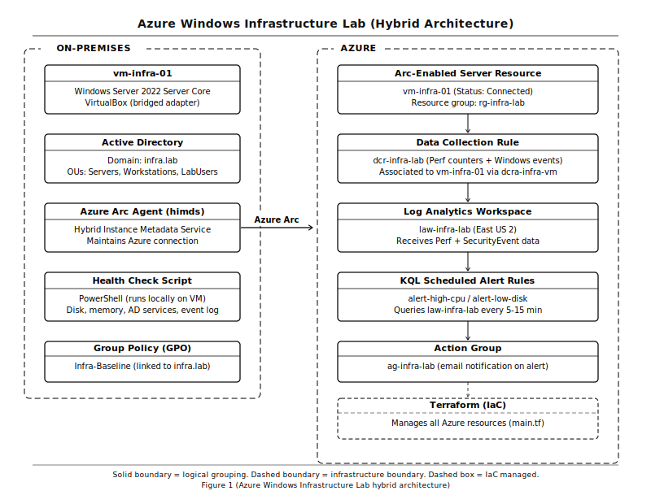

# Azure Windows Infrastructure Lab

A five-part hybrid infrastructure project connecting a local Windows Server 2022 VM to Azure using Arc, Terraform, and Azure Monitor. Built to demonstrate real-world SysAdmin skills including Active Directory, cloud monitoring, and infrastructure as code.

## Architecture

- Local VM running Windows Server 2022 Server Core on VirtualBox
- Azure Arc connecting the on-premises VM to Azure for management and monitoring
- Terraform managing all Azure-side infrastructure
- Log Analytics Workspace receiving performance and event data
- KQL-based alert rules for CPU, disk, and failed login detection
- PowerShell health check script running locally on the domain controller

## Project Structure

azure-windows-infra-lab/
  terraform/
    main.tf
    variables.tf
    outputs.tf
  scripts/
    health-check.ps1
  .gitignore

## Parts

**Part 1: Windows Server VM and Azure Foundation**
VirtualBox VM running Windows Server 2022 Server Core. Terraform deploys the Azure resource group and Log Analytics Workspace.

**Part 2: Active Directory**
Server promoted to domain controller for infra.lab. OUs created for Servers, Workstations, and LabUsers. Users jsmith and jdoe provisioned. Baseline GPO linked to the domain.

**Part 3: Azure Arc and Azure Monitor**
VM onboarded to Azure Arc. Azure Monitor Agent deployed via Arc extension. Data Collection Rule configured to collect Windows event logs and performance counters.

**Part 4: KQL Alert Rules**
Scheduled query alert rules deployed via Terraform targeting the Log Analytics Workspace. Alerts configured for high CPU usage and low disk space. Failed login alert rule written and ready, pending SecurityEvent table population.

**Part 5: PowerShell Health Check**
Scheduled script checks AD service status, disk space, available memory, and recent system errors. Output written to a local report file.

## Known Limitation

The Azure Monitor Agent fails to register as a Windows service on Windows Server 2022 Evaluation edition. The Arc extension reports success but the agent process does not start. All Azure-side resources including the DCR and association are correctly deployed and verified. This limitation does not apply to licensed editions of Windows Server 2022 Standard or Datacenter.

Microsoft documentation confirms the MSI installer path is intentionally blocked on Windows Server SKUs and that Arc extension deployment is the only supported path for server operating systems. Reference: [AMA Windows Client Installer](https://learn.microsoft.com/en-us/azure/azure-monitor/agents/azure-monitor-agent-windows-client)

The Arc extension deployment mechanism enforces a 300MB uncompressed file size limit. Older AMA extension builds exceeded this limit causing silent installation failures. This is a documented platform constraint. Reference: [AMA Stuck in Creating - Microsoft Q&A](https://learn.microsoft.com/en-in/answers/questions/5564617/cannot-update-azure-monitor-windows-agent-stuck-in)

## Lessons Learned

**Server Core has no GUI and that is a good thing.**
The VM was installed as Windows Server 2022 Server Core rather than Desktop Experience. All configuration including Active Directory setup, OU creation, user provisioning, and GPO linking was done entirely through PowerShell. This mirrors how enterprise domain controllers are actually managed and turned out to be a stronger demonstration of skill than a GUI-based setup would have been.

**The built-in Users container is not an OU.**
When creating OUs, the New-ADOrganizationalUnit command for "Users" failed because Active Directory already has a built-in CN=Users container at the same path. The fix was creating a custom OU named LabUsers to avoid the naming conflict. This distinction between CN containers and OU objects matters when writing automation that targets specific paths.

**Terraform pins can cause silent failures.**
The Azure Monitor Agent extension was pinned to version 1.22 in the Terraform configuration. The extension reported success in the portal but the agent never installed on the VM. Removing the version pin allowed Azure to deploy the latest build and resolved the deployment issue. Pinning versions is good practice for stability but requires testing against the target environment.

**The Arc extension mechanism has a 300MB extraction limit.**
Azure Arc uses a Guest Configuration agent to deploy extensions. This agent enforces a 300MB uncompressed file size limit. Older AMA extension builds exceeded this limit, causing silent installation failures even when the portal reported success. This is a documented Microsoft limitation and not a misconfiguration. Reference: [300MB unzip limit documentation](https://learn.microsoft.com/en-in/answers/questions/5564617/cannot-update-azure-monitor-windows-agent-stuck-in)

**The MSI installer for AMA does not work on Windows Server.**
When the extension route was not working, a manual MSI install was attempted. Microsoft intentionally blocks the AMA MSI installer on Windows Server SKUs. The only supported path for Windows Server is Arc extension or VM extension deployment. The MSI is only for Windows client operating systems. Reference: [AMA supported operating systems](https://learn.microsoft.com/en-us/azure/azure-monitor/agents/azure-monitor-agent-supported-operating-systems)

**RDP clipboard requires a specific setting before connecting.**
Copy and paste between the host machine and the VM over RDP does not work by default unless the Clipboard option is checked under Local Resources in the Remote Desktop Connection client before the session is established. If clipboard stops working mid-session, restarting rdpclip.exe inside the VM restores it without disconnecting.

**Terraform state rm forces a clean redeploy.**
When the AMA extension needed a fresh install without changing the Terraform configuration, using terraform state rm removed the resource from state without destroying it in Azure. Combined with deleting the extension from the portal, this forced Terraform to treat it as a new resource on the next apply.

**File transfers to a Server Core VM go through tsclient.**
Without a GUI or shared folder, the fastest way to transfer files from the host machine to the VM is through the RDP drive mapping. With local drives enabled in the RDP client, the host filesystem is accessible inside the VM at the path \\tsclient\C. This was used to transfer both the AMA installer and the health check script.

## Tools Used

- VirtualBox
- Windows Server 2022 Server Core
- Azure Arc
- Azure Monitor
- Log Analytics
- Terraform
- PowerShell
- Azure CLI
- Visual Studio Code
- Remote Desktop Connection (RDP)
- Azure Portal